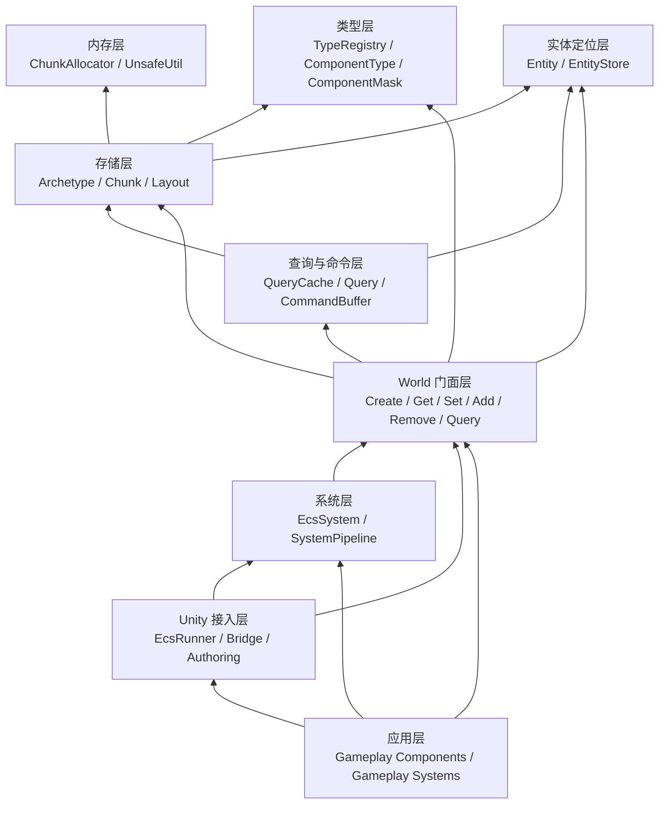

# CyanMothUnityEcs 架构关系总览

> 这份文档从最底层内存一路讲到最上层 Unity 应用层，回答三个问题：
>
> 1. 每一层要实现什么功能。
> 2. 每一层依赖谁、服务谁。
> 3. 一次 ECS 操作会怎样穿过这些层。
>
> 当前项目还在阶段 A：已经完成 `ComponentMask`、`TypeRegistry`、`Entity`、`EntityStore` 等地基层。本文会同时标明“当前已实现”和“后续要实现”的部分。

---

## 一、整体分层图

从底层到上层，CyanMothUnityEcs 可以分成这些层：

```text
应用层 Application
-> Unity 接入层 Unity Bridge
-> 系统层 System Pipeline
-> World 门面层 World API
-> 查询与命令层 Query / CommandBuffer
-> 存储层 Archetype / Chunk
-> 实体定位层 EntityStore
-> 类型层 TypeRegistry / ComponentType / ComponentMask
-> 内存层 Native Memory / UnsafeUtil / ChunkAllocator
```

它们的核心关系是：



注意箭头方向表示“上层使用下层”。底层不应该反过来知道上层存在。

---

## 二、内存层：真正放数据的地方

### 负责什么

内存层负责申请、对齐、复用、释放 ECS 的底层连续内存。

后续主要脚本：

| 脚本 | 状态 | 功能 |
|---|---|---|
| `UnsafeUtil.cs` | 待实现 | 提供对齐、拷贝、清零、大小计算等底层工具。 |
| `ChunkAllocator.cs` | 待实现 | 批量申请 native memory，并把内存切成固定大小 Chunk。 |
| `Chunk.cs` | 待实现 | 定义 Chunk Header，也就是一块 Chunk 头部保存的元信息。 |

### 它和其他层的关系

内存层不理解 `Position`、`Velocity`、`Health` 这些业务组件，也不理解系统逻辑。

它只关心：

```text
给我一块 16 KiB 的对齐内存
我把这块内存交给 Chunk 使用
不用时我回收这块内存
World 销毁时我统一释放所有内存
```

存储层会调用它：

```text
Archetype 需要新 Chunk
-> ChunkAllocator.Allocate
-> 得到一块可写 Chunk
```

### 为什么重要

ECS 的性能不是来自 `Entity` 这个概念本身，而是来自数据连续摆放。

如果内存层做对了，系统遍历时就是：

```text
Position[0]
Position[1]
Position[2]
...
```

CPU 可以很容易预取后面的数据。

如果内存层做错了，系统遍历就会变成到处跳：

```text
Position 指针 -> 另一个对象 -> 另一个数组 -> 再找 Velocity
```

这样就失去了 ECS 的主要价值。

---

## 三、类型层：给组件一个稳定编号

### 当前已实现

| 脚本 | 状态 | 功能 |
|---|---|---|
| `IComponentData.cs` | 已实现 | 标记某个 `struct` 可以作为 ECS 组件。 |
| `ComponentType.cs` | 已实现 | 保存单个组件的运行时元数据。 |
| `ComponentTypeCache.cs` | 已实现 | 为每个泛型组件缓存 `ComponentType`。 |
| `TypeRegistry.cs` | 已实现 | 给组件分配稳定的 `TypeIndex`。 |
| `ComponentMask.cs` | 已实现 | 用 128 位 bit mask 表示组件集合。 |

### 每个东西具体做什么

`IComponentData` 表示：

```text
这个 struct 是 ECS 组件
它只应该保存数据
它可以进入 Chunk
```

`TypeRegistry` 表示：

```text
Position 是第 0 号组件
Velocity 是第 1 号组件
Health 是第 2 号组件
```

`ComponentType` 保存：

```text
组件编号 Index
组件大小 Size
组件对齐 Align
是否是 Tag 组件 IsTag
组件对应的 C# 类型 ManagedType
组件自己的 ComponentMask
```

`ComponentMask` 表示组件组合，例如：

```text
Position           -> 0001
Velocity           -> 0010
Position+Velocity  -> 0011
Health             -> 0100
```

真实实现里不是 4 位，而是固定 128 位。

### 它和其他层的关系

类型层服务于三个核心模块：

```text
Archetype
-> 用 ComponentMask 表示自己有哪些组件

Query
-> 用 IncludeMask 找到包含指定组件的 Archetype

CommandBuffer
-> 用 TypeIndex 记录 Add/Remove/Set 的组件类型
```

所以类型层必须先稳定。没有稳定的 `TypeIndex`，后面的 `Archetype`、`Query`、`Chunk Layout` 都无法可靠工作。

---

## 四、实体定位层：Entity 是句柄，EntityStore 才知道位置

### 当前已实现

| 脚本 | 状态 | 功能 |
|---|---|---|
| `Entity.cs` | 已实现 | 对外实体句柄，只保存 `Id` 和 `Version`。 |
| `EntityStore.cs` | 已实现 | 保存 Entity 当前所在的 Chunk、slot、Archetype。 |

### Entity 做什么

`Entity` 不是对象，也不是组件容器。

它只是一个句柄：

```csharp
public readonly struct Entity
{
    public readonly int Id;
    public readonly int Version;
}
```

可以理解成：

```text
Id      -> 去 EntityStore 哪个数组下标查
Version -> 判断这个句柄有没有过期
```

### EntityStore 做什么

`EntityStore` 是实体位置表。它保存这些数组：

```text
versions[id]     -> 当前版本号
chunks[id]       -> 当前所在 Chunk 地址
indices[id]      -> 当前在 Chunk 里的第几个 slot
archetypeIds[id] -> 当前属于哪个 Archetype
freeIds[]        -> 可以复用的 Entity Id
```

### 它和其他层的关系

创建实体时：

```text
World.Create
-> EntityStore.Create
-> 得到 Entity(Id, Version)
-> 写入 Chunk
-> EntityStore.SetLocation(entity, chunk, index, archetypeId)
```

随机访问组件时：

```text
World.Get<T>(entity)
-> EntityStore.Validate(entity)
-> EntityStore.GetChunk(entity)
-> EntityStore.GetIndex(entity)
-> 根据 Chunk + index 找到组件数据
```

结构变更时：

```text
Add/Remove/Destroy 导致实体换位置
-> 迁移 Chunk 数据
-> EntityStore.SetLocation 更新新位置
```

删除实体时：

```text
Destroy
-> 从 Chunk 里 swap-remove
-> EntityStore.Release(entity)
-> Version++
-> 旧 Entity 句柄失效
```

### 关键结论

实体本身不持有 `ComponentMask`。

真正持有关系是：

```text
Entity
-> 通过 Id 找 EntityStore
-> EntityStore 告诉它当前在哪个 Archetype
-> Archetype 持有 ComponentMask
```

也就是：

```text
Entity 不知道自己有什么组件
Archetype 知道这一组实体有什么组件
EntityStore 知道某个 Entity 属于哪个 Archetype
```

---

## 五、存储层：Archetype + Chunk + SoA

### 后续要实现

| 脚本 | 状态 | 功能 |
|---|---|---|
| `Archetype.cs` | 待实现 | 表示一组完全相同的组件组合。 |
| `ArchetypeStore.cs` | 待实现 | 管理所有 Archetype，并通过 mask 查找。 |
| `ArchetypeLayout.cs` | 待实现 | 计算 Chunk 内每个组件数组的偏移。 |
| `ArchetypeGraph.cs` | 待实现 | 缓存 Add/Remove 后的目标 Archetype。 |
| `Chunk.cs` | 待实现 | 保存一批同 Archetype 实体的数据。 |

### Archetype 做什么

Archetype 表示“组件组合完全相同的一组实体”。

例如：

```text
Archetype A = [Position, Velocity]
Archetype B = [Position, Velocity, Health]
Archetype C = [Position, SpriteProxy]
```

每个 Archetype 持有：

```text
Id
Mask
ComponentType[]
ChunkLayout
FirstChunk / LastChunk / FirstFreeChunk
AddEdges / RemoveEdges
```

### Chunk 做什么

Chunk 是一块固定大小的连续内存。

一个 Chunk 只属于一个 Archetype，只存同一种组件组合的实体。

以 `[Position, Velocity]` 为例：

```text
Chunk
├── Header
├── Entity[]
├── Position[]
└── Velocity[]
```

这里的 `Position[]` 和 `Velocity[]` 是 SoA 布局。

SoA 是 `Structure of Arrays`，意思是：

```text
所有 Position 连续放一起
所有 Velocity 连续放一起
```

不是这样：

```text
Entity0(Position, Velocity)
Entity1(Position, Velocity)
Entity2(Position, Velocity)
```

而是这样：

```text
Position0 Position1 Position2 ...
Velocity0 Velocity1 Velocity2 ...
```

### 它和其他层的关系

类型层告诉它：

```text
每个组件的 TypeIndex / Size / Align / Mask
```

内存层给它：

```text
一块可写 Chunk 内存
```

EntityStore 记录：

```text
某个 Entity 当前在这个 Chunk 的第几个 slot
```

Query 遍历它：

```text
Query 命中 Archetype
-> 遍历 Archetype 下所有 Chunk
-> 拿到 Position* / Velocity*
-> 连续 for 循环
```

CommandBuffer 回放时会移动它：

```text
Add Health
-> 从 Archetype [Position, Velocity]
-> 迁移到 Archetype [Position, Velocity, Health]
```

---

## 六、查询层：Query 只找 Archetype，不逐实体 Has

### 后续要实现

| 脚本 | 状态 | 功能 |
|---|---|---|
| `QueryCache.cs` | 待实现 | 缓存 Query 命中的 Archetype 列表。 |
| `Query.cs` | 待实现 | 提供 `Query<T>`、`Query<T1,T2>` 等查询入口。 |
| `QueryDelegates.cs` | 待实现 | 定义 `ForEach` 和 `ForEachChunk` 的回调类型。 |

### Query 做什么

用户写：

```csharp
World.Query<Position, Velocity>()
```

底层会生成：

```text
IncludeMask = Position.Mask | Velocity.Mask
```

然后 QueryCache 找：

```text
所有 Archetype.Mask 包含 IncludeMask 的 Archetype
```

也就是：

```text
[Position, Velocity]         -> 命中
[Position, Velocity, Health] -> 命中
[Position]                   -> 不命中
[Velocity]                   -> 不命中
```

### 它和其他层的关系

Query 依赖：

```text
TypeRegistry
-> 得到组件 TypeIndex 和 Mask

ArchetypeStore
-> 找到匹配的 Archetype

Chunk Layout
-> 找到每种组件在 Chunk 中的偏移
```

Query 不应该依赖：

```text
所有 Entity 列表
逐实体 HasComponent 检查
Sparse Set 查找
```

### ForEach 和 ForEachChunk 的关系

`ForEachChunk` 是底层高性能入口：

```text
直接给用户 Entity* / Position* / Velocity* / count
用户自己写 for 循环
```

`ForEach` 是易用包装：

```text
内部仍然调用 ForEachChunk
然后把数组第 i 个元素转成 ref 参数
```

关系是：

```text
ForEach
-> ForEachChunk
-> Archetype
-> Chunk
-> Component pointer
```

---

## 七、命令层：CommandBuffer 负责安全地改结构

### 后续要实现

| 脚本 | 状态 | 功能 |
|---|---|---|
| `CommandKind.cs` | 待实现 | 表示 Create、Destroy、Add、Remove、Set 等命令类型。 |
| `CommandBuffer.cs` | 待实现 | 记录结构变更命令，并在安全点回放。 |

### 为什么需要 CommandBuffer

Query 正在遍历 Chunk 时，不能立刻 Add/Remove/Destroy。

原因是：

```text
Add/Remove 会让实体迁移到另一个 Archetype
Destroy 会让 Chunk swap-remove
这些操作会改变当前正在遍历的数据结构
```

所以结构变更必须延迟：

```text
系统中记录命令
系统结束后 Playback
Playback 时统一执行迁移或删除
```

### 它和其他层的关系

CommandBuffer 记录：

```text
Entity Id
Entity Version
CommandKind
Component TypeIndex
Component payload bytes
```

Playback 时依赖：

```text
EntityStore
-> 验证 Entity 是否还活着

ArchetypeGraph
-> 找 Add/Remove 后的目标 Archetype

Chunk
-> 拷贝旧组件，写入新组件，swap-remove 旧 slot

EntityStore
-> 更新实体新位置
```

---

## 八、World 门面层：用户操作 ECS 的统一入口

### 后续要实现

| 脚本 | 状态 | 功能 |
|---|---|---|
| `World.cs` | 待实现 | 持有所有核心模块，并暴露用户 API。 |
| `World.Create.cs` | 待实现 | 创建实体并写入组件数据。 |
| `World.Access.cs` | 待实现 | `Get<T>`、`Set<T>`、`Has<T>`。 |
| `World.StructuralChanges.cs` | 待实现 | Add、Remove、Destroy、迁移。 |

### World 做什么

World 是上层看见的“ECS 世界”。

它内部持有：

```text
EntityStore
ArchetypeStore
ChunkAllocator
QueryCache
CommandBuffer
```

用户不应该直接操作这些底层模块，而是通过 World：

```csharp
Entity e = world.Create(new Position(), new Velocity());
ref Position p = ref world.Get<Position>(e);
world.Commands.Destroy(e);
world.Query<Position, Velocity>().ForEachChunk(...);
```

### 它和其他层的关系

World 向上服务：

```text
System
Unity Runner
Gameplay Code
Authoring Collector
```

World 向下组织：

```text
TypeRegistry
EntityStore
ArchetypeStore
ChunkAllocator
QueryCache
CommandBuffer
```

也就是说，World 是“总控台”，但不是所有逻辑都写在一个大类里。

推荐拆分：

```text
World.cs
-> 生命周期、模块持有、Dispose

World.Create.cs
-> Create / CreateMany

World.Access.cs
-> Get / Set / Has

World.StructuralChanges.cs
-> Add / Remove / Destroy / MoveEntity
```

---

## 九、系统层：把一帧逻辑串起来

### 后续要实现

| 脚本 | 状态 | 功能 |
|---|---|---|
| `EcsSystem.cs` | 待实现 | 系统基类，提供 `OnCreate`、`OnUpdate`、`OnDestroy`。 |
| `SystemPipeline.cs` | 待实现 | 按顺序执行系统，并在安全点 Playback。 |

### 系统做什么

组件只保存数据，系统保存行为。

例如：

```text
Position 是数据
Velocity 是数据
MovementSystem 是行为
```

一个移动系统会做：

```text
Query<Position, Velocity>
-> 遍历所有匹配 Chunk
-> position += velocity * dt
```

### Pipeline 做什么

Pipeline 负责一帧里系统的执行顺序：

```text
MovementSystem.OnUpdate
-> World.Playback
DamageSystem.OnUpdate
-> World.Playback
DeathSystem.OnUpdate
-> World.Playback
TransformSyncSystem.OnUpdate
-> World.Playback
```

第一版不做复杂并行，不做依赖分析。

先保证：

```text
顺序确定
结构变更安全
生命周期清楚
```

---

## 十、Unity 接入层：Unity 对象只做桥接，不进 Chunk

### 后续要实现

| 脚本 | 状态 | 功能 |
|---|---|---|
| `EcsRunner.cs` | 待实现 | 把 Unity 生命周期接到 World 和 Pipeline。 |
| `TransformBridge.cs` | 待实现 | 保存 `int id -> Transform` 的映射。 |
| `TransformProxy.cs` | 待实现 | ECS 组件，只保存 Transform 的代理 Id。 |
| `TransformSyncSystem.cs` | 待实现 | 把 ECS Position 同步回 Unity Transform。 |
| `EcsSpawnAuthoring.cs` | 待实现 | Inspector 配置入口。 |
| `RuntimeAuthoringCollector.cs` | 待实现 | 运行时收集 Authoring 并生成 ECS 数据。 |

### 为什么 Unity 对象不进 Chunk

`Transform`、`SpriteRenderer`、`GameObject` 都是 Unity 引用对象。

它们不适合直接放进高性能 Chunk，因为：

```text
它们不是纯数据
它们访问时会跳到 Unity 引擎对象
它们会破坏 Chunk 连续数据模型
它们不能被简单 memcpy
```

所以 ECS 组件只保存代理 Id：

```csharp
public struct TransformProxy : IComponentData
{
    public int Id;
}
```

真实 Transform 放在 Bridge：

```text
TransformBridge
-> Transform[] transforms
-> int Register(Transform transform)
-> Transform Get(int id)
```

### SpriteRenderer 这类组件怎么接

实际业务中，如果需要 Unity 自带组件，比如 `SpriteRenderer`：

```text
ECS Chunk 里不保存 SpriteRenderer
ECS Chunk 里保存 SpriteProxyId / RenderProxyId
Bridge 表里保存 SpriteRenderer 引用
渲染同步系统读取 ECS 数据，然后写 SpriteRenderer
```

关系是：

```text
ECS Position / SpriteRenderState / SpriteProxy
-> SpriteRendererBridge.Get(proxyId)
-> 写 Unity SpriteRenderer / Transform
```

这样既能保留 Unity 组件能力，又不把 Unity 对象污染进 ECS 热路径。

---

## 十一、应用层：真正写玩法的地方

### 用户主要写什么

应用层通常写四类东西：

```text
Component
System
Authoring
Bootstrap / Runner 配置
```

例如：

```csharp
public struct Position : IComponentData
{
    public float X;
    public float Y;
    public float Z;
}
```

```csharp
public sealed class MovementSystem : EcsSystem
{
    protected override void OnUpdate(float dt)
    {
        World.Query<Position, Velocity>().ForEachChunk(...);
    }
}
```

应用层不应该关心：

```text
Chunk 具体地址
组件 offset
Archetype graph 细节
EntityStore 内部数组
CommandBuffer 二进制格式
```

这些由底层封装。

### 应用层和底层的关系

用户写的是：

```text
我要让所有有 Position 和 Velocity 的实体移动
```

底层做的是：

```text
Position + Velocity -> IncludeMask
IncludeMask -> 匹配 Archetype
Archetype -> 遍历 Chunk
Chunk -> 拿 Position* 和 Velocity*
for 循环 -> 连续读写
```

应用层越简单，底层越应该明确。

---

## 十二、三条最重要的数据链路

### 1. 创建链路

```text
用户代码
-> World.Create<T1,T2>
-> TypeRegistry 获取组件类型
-> ComponentMask 组合组件集合
-> ArchetypeStore 找到目标 Archetype
-> ChunkAllocator 准备可写 Chunk
-> Chunk 分配 slot
-> EntityStore.Create 得到 Entity
-> 写 Entity[] 和组件数组
-> EntityStore.SetLocation
```

一句话：

```text
创建实体就是直接进入最终 Archetype，并把组件写进 Chunk。
```

### 2. 查询链路

```text
用户代码
-> World.Query<T1,T2>
-> QueryCache 根据 IncludeMask 找 Archetype
-> 遍历匹配 Archetype
-> 遍历 Archetype 下的 Chunk
-> 根据 Layout 找组件指针
-> ForEachChunk 连续扫描
```

一句话：

```text
查询不是找实体，而是先找符合条件的 Archetype，再扫它们的 Chunk。
```

### 3. 结构变更链路

```text
用户代码
-> CommandBuffer.Add/Remove/Destroy
-> SystemPipeline 安全点调用 World.Playback
-> EntityStore 验证 Entity
-> ArchetypeGraph 找目标 Archetype
-> 迁移组件数据到目标 Chunk
-> 旧 Chunk swap-remove
-> EntityStore 更新被移动实体位置
-> EntityStore.Release 或 SetLocation
```

一句话：

```text
结构变更不是在原地改组件列表，而是把实体整行迁移到另一个 Archetype。
```

---

## 十三、当前代码和完整架构的对应关系

当前已经完成的是：

```text
类型层
-> IComponentData
-> ComponentType
-> ComponentTypeCache<T>
-> TypeRegistry
-> ComponentMask

实体定位层
-> Entity
-> EntityStore
```

还没完成的是：

```text
内存层
-> UnsafeUtil
-> ChunkAllocator
-> Chunk

存储层
-> Archetype
-> ArchetypeStore
-> ArchetypeLayout
-> ArchetypeGraph

World 门面层
-> World.Create
-> World.Get/Set/Has
-> World.Add/Remove/Destroy

查询与命令层
-> QueryCache
-> Query<T>
-> CommandBuffer

系统层
-> EcsSystem
-> SystemPipeline

Unity 接入层
-> EcsRunner
-> TransformBridge
-> Authoring Collector
```

所以现在项目还不能真正“存组件到 Chunk”，但已经有了后续所有层都要依赖的两个地基：

```text
组件身份
实体身份与位置表
```

---

## 十四、模块关系速查表

| 模块 | 它实现什么 | 它依赖什么 | 谁依赖它 |
|---|---|---|---|
| `IComponentData` | 标记组件类型 | 无 | 所有组件、TypeRegistry |
| `ComponentType` | 组件元数据 | ComponentMask | ArchetypeLayout、Query、CommandBuffer |
| `ComponentTypeCache<T>` | 泛型静态缓存 | TypeRegistry | World、Query、CommandBuffer |
| `TypeRegistry` | 分配 TypeIndex | IComponentData、ComponentType | Archetype、Query、World |
| `ComponentMask` | 组件集合 bitset | TypeRegistry 上限 | Archetype、QueryCache |
| `Entity` | 实体句柄 | 无 | World、CommandBuffer、用户代码 |
| `EntityStore` | Entity 到 Chunk slot 的映射 | Entity | World、结构变更、Query 调试 |
| `ChunkAllocator` | 分配 Chunk 内存 | UnsafeUtil | Archetype、World |
| `Chunk` | 保存一批实体和组件数据 | ArchetypeLayout | Query、World、CommandBuffer |
| `Archetype` | 相同组件组合的实体集合 | ComponentMask、Chunk | Query、World、CommandBuffer |
| `ArchetypeStore` | 管理所有 Archetype | TypeRegistry、ComponentMask | World、QueryCache |
| `QueryCache` | 缓存查询命中的 Archetype | ComponentMask、ArchetypeStore | Query |
| `CommandBuffer` | 延迟结构变更 | Entity、ComponentType | SystemPipeline、World |
| `World` | ECS 统一入口 | 所有核心模块 | System、Unity、应用层 |
| `EcsSystem` | 玩法逻辑单元 | World | SystemPipeline、应用层 |
| `SystemPipeline` | 系统执行顺序和安全点 | EcsSystem、World | Unity Runner |
| `EcsRunner` | Unity 生命周期入口 | World、SystemPipeline | Unity 场景 |
| `Bridge` | Unity 对象映射 | UnityEngine 对象、ECS Proxy | Unity 同步系统 |

---

## 十五、为什么这套关系不能乱

### 1. Entity 不能直接持有组件

如果 Entity 直接保存组件列表，就会变成对象模型：

```text
Entity
-> List<Component>
```

这样 Query 就会退化成逐实体检查，性能路线会偏离 `Archetype + Chunk`。

正确关系是：

```text
Entity 是句柄
EntityStore 记录位置
Archetype 表示组件组合
Chunk 保存真实数据
```

### 2. Query 不能逐实体 Has

如果 Query 做：

```text
for every entity
    Has Position?
    Has Velocity?
```

那就接近 Sparse Set 或普通对象遍历。

正确关系是：

```text
Query 先匹配 Archetype
然后只扫匹配 Chunk
```

### 3. Unity 对象不能进 Chunk

如果 `Transform`、`SpriteRenderer` 直接进组件：

```text
Chunk 里会保存托管引用
数据不再是纯连续 unmanaged 数据
memcpy 和 Burst/Jobs 适配都会变难
```

正确关系是：

```text
Chunk 里保存 proxy id
Bridge 保存 Unity 对象引用
同步系统跨边界读写
```

### 4. 便捷 API 不能绕开底层路径

`ForEach`、`CreateMany`、`Prefab` 都可以做得好用，但它们必须最终落到底层：

```text
ForEach -> ForEachChunk
CreateMany -> Chunk 连续写
Prefab -> 已知 Archetype + 默认组件数据
```

如果便捷 API 自己另开一套存储，就会让系统复杂度和性能风险一起上升。

---

## 十六、推荐实现顺序

后续继续实现时，建议按这个顺序推进：

```text
1. UnsafeUtil
2. Chunk
3. ChunkAllocator
4. ArchetypeLayout
5. Archetype
6. ArchetypeStore
7. World.Create / Get / Set / Has
8. StructuralChanges / ArchetypeGraph
9. CommandBuffer
10. QueryCache / Query
11. EcsSystem / SystemPipeline
12. Unity Bridge
13. Authoring / SpawnCatalog
14. Debug / Benchmark
15. Convenience API
```

理由很简单：

```text
没有 Chunk，就没有真实数据存储
没有 Archetype，就没有组件组合分组
没有 World.Create，就没有实体进入 Chunk
没有结构变更，就不能 Add/Remove/Destroy
没有 CommandBuffer，就不能安全地在系统里改结构
没有 Query，就不能高效批量处理数据
没有 SystemPipeline，才轮不到 Unity 接入
```

---

## 十七、最终心智模型

可以把整个 ECS 想成一条从上到下、再从下到上的链路。

用户看到的是：

```text
组件
实体
系统
World
```

底层真正发生的是：

```text
TypeIndex
ComponentMask
Archetype
Chunk
EntityStore location
Component pointer
连续 for 循环
```

最重要的一句话：

```text
应用层写的是“哪些数据参与什么逻辑”，底层实现的是“这些数据如何连续摆放并被高效遍历”。
```

只要每一层都守住自己的职责，CyanMothUnityEcs 后续加 Burst、Jobs、Enableable、ChangeVersion、批量渲染、Authoring 替代方案，都不会推翻核心结构。
